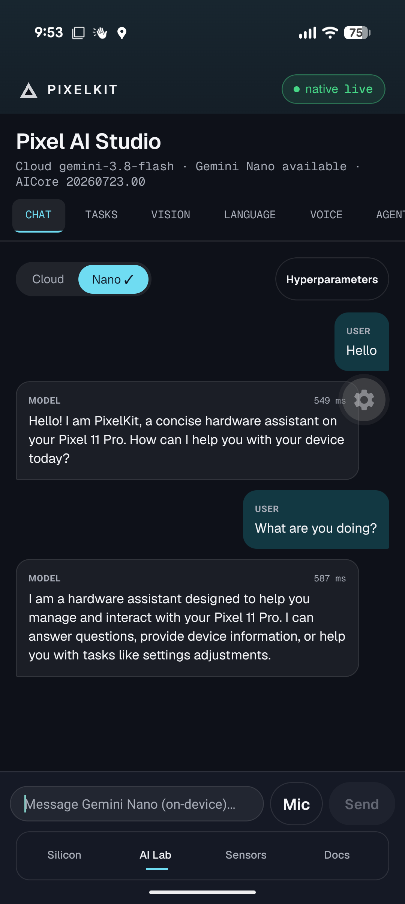
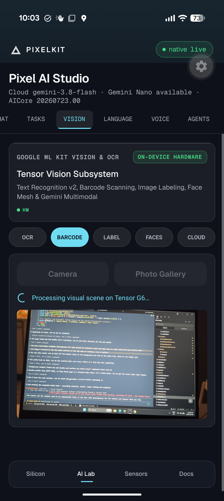
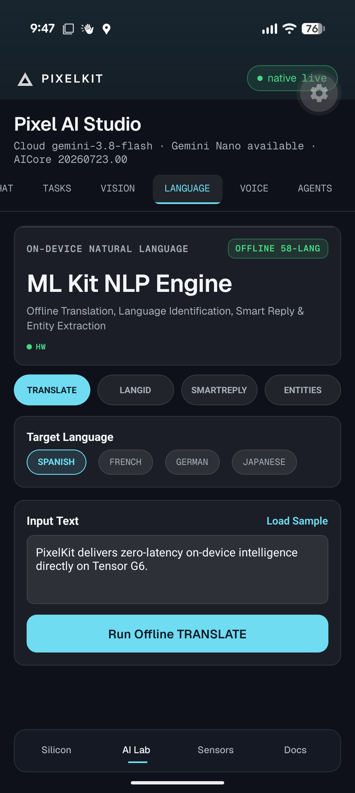
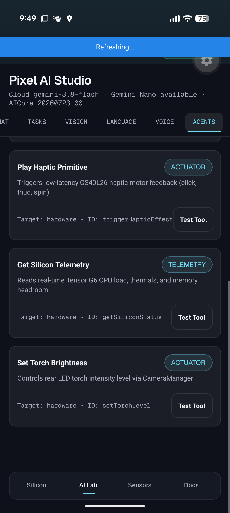
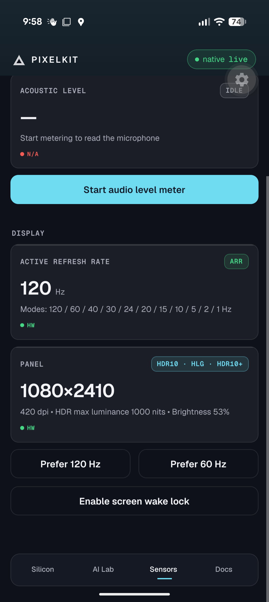
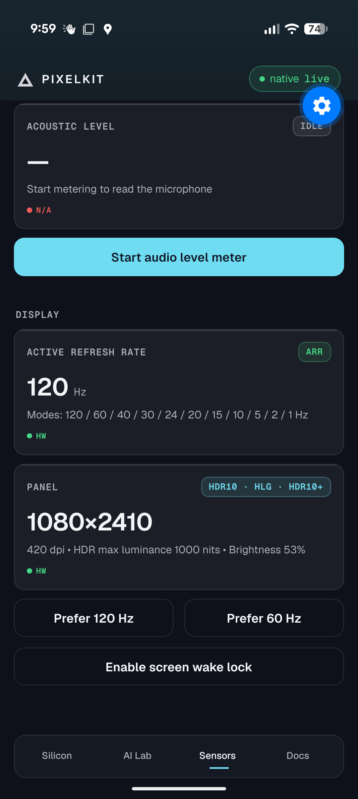
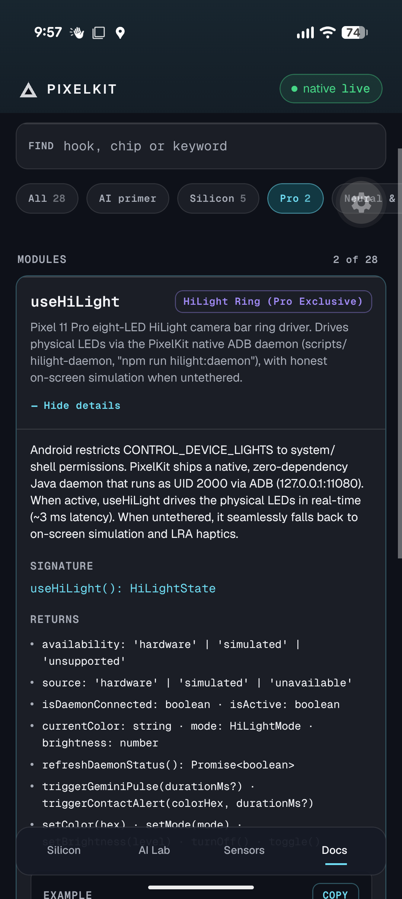

# PixelKit SDK

> **The Hardware &amp; AI Framework for Google Pixel &amp; Android**  
> *Hardware and AI framework for the Google Pixel 11 Pro.*

---

## 📖 Executive Summary

**PixelKit** is a modular Expo SDK 57 framework that exposes Google Pixel 11 Pro hardware (Tensor G6 CPU, PowerVR GPU, AICore/TPU, Android Keystore, 1-120 Hz LTPO display, HiLight, UWB, IMU and environmental sensors) as typed React hooks, with cloud Gemini for chat, vision and speech.

This document serves as the **canonical API Reference and Blueprint for AI agents (including the future Delta Bot)** and developers building on top of this framework.

---

## 📱 Production Interface Gallery


| Silicon Dashboard                                                        | On-Device Gemini Nano Chat                                                 |
| :------------------------------------------------------------------------: | :--------------------------------------------------------------------------: |
|  |  |


| On-Device Vision Subsystem                                                   | Offline 58-Language Translation                                                     |
| :----------------------------------------------------------------------------: | :-----------------------------------------------------------------------------------: |
|  |  |


| Android 17 AppFunctions Actuators                                         | Hardware &amp; Sensor Lab                                              |
| :-------------------------------------------------------------------------: | :----------------------------------------------------------------------: |
|  |  |


| Physical UWB &amp; Torch Actuators                                       | Interactive In-App API Docs                                                  |
| :------------------------------------------------------------------------: | :----------------------------------------------------------------------------: |
|  |  |


*All views captured from the live Google Pixel 11 Pro testbed. Strict provenance tagging (`HW`, `DERIVED`, `SIMULATED`, `N/A`) is enforced on every card.*

---

## 🛠️ Android CLI &amp; Tooling Integration

PixelKit integrates with Google's official **Android CLI** (`android.exe`).

### Installation

- **Windows**: `curl.exe -fsSL https://dl.google.com/android/cli/latest/windows_x86_64/install.cmd -o "%TEMP%\i.cmd" && "%TEMP%\i.cmd"`
- **macOS**: `curl -fsSL https://dl.google.com/android/cli/latest/darwin_arm64/install.sh | bash`
- **Linux**: `curl -fsSL https://dl.google.com/android/cli/latest/linux_x86_64/install.sh | bash`

### Project Describing (`android describe`)

Agents and tools can analyze project structure, build targets, and APK artifact outputs:

```bash
android describe --project_dir=<path>
```

- **Device Inspection**: `android layout` (JSON UI tree) &amp; `android screen` (visual bounds &amp; screenshots).
- **CLI Skills**: Built-in skill instructions available in `.agents/skills/android-cli/` and 26 official Expo skills (`.agents/skills/` via `npx skills add expo/skills` and `skills-lock.json`).

---

## 🏛️ Project Architecture

```text
pixel-delta/ (PixelKit Framework)
├── App.tsx                     # Main App Shell & 4-Tab Navigator (HUD, AI Lab, Sensors, Docs)
├── PIXELKIT.md                 # Canonical AI Reference & SDK Documentation
├── README.md                   # Developer Setup & Prerequisites
├── skills-lock.json            # Deterministic lockfile for installed agent skills
├── app.json                    # Android 15/16 Permissions & 120Hz LTPO Manifest
├── .agents/skills/             # Built-in Agent Skills
│   ├── android-cli/            # Google Android CLI skill (SDK, emulator, device inspection)
│   └── expo/skills             # 26 Expo skills (expo-router, expo-ui, expo-module, eas-*, etc.)
├── src/
│   ├── index.ts                # Master barrel export for all hooks and primitives
│   ├── core/
│   │   └── types.ts            # Strongly-typed telemetry, silicon, and AI models
│   │
│   ├── hardware/               # Physical Silicon & Hardware Abstractions
│   │   ├── useCPU.ts           # /proc/cpuinfo + cpufreq topology, frequencies, governor, load
│   │   ├── useGPU.ts           # PowerVR / Vulkan frame pacing (8.33ms budget) & dropped frames
│   │   ├── useMemory.ts        # LPDDR5X RAM usage, free memory & Low Memory Killer (LMK) protection
│   │   ├── useADPF.ts          # Android Dynamic Performance Framework (CPU/GPU headroom & thermals)
│   │   ├── useSensors.ts       # 6-Axis Motion (Gyro/Accel), Barometer/Altimeter, Compass, Light
│   │   ├── useHaptics.ts       # Linear Resonant Actuator tactile waveforms & mechanical ticks
│   │   ├── useCamera.ts        # expo-camera zoom, flash, lens; Look label as UI state
│   │   ├── useHiLight.ts       # [Pixel Pro Exclusive] Rear camera bar notification LED ring
│   │   ├── useTorch.ts         # Hardware LED flashlight & emergency SOS strobe controller
│   │   ├── useDevice.ts        # Pixelsnap Qi2.2 25W charging, battery health & telemetry
│   │   ├── useDisplay.ts       # 3,600 nits 120Hz LTPO OLED display, screen wake lock & brightness
│   │   ├── useBiometrics.ts    # Ultrasonic fingerprint & face unlock (expo-local-authentication)
│   │   ├── useSecurity.ts      # SecureStore on the Android Keystore (StrongBox)
│   │   ├── useLocation.ts      # Multi-band GNSS satellite positioning, altitude & heading
│   │   ├── useNetwork.ts       # MediaTek M90 Wi-Fi 7, 5G Sub-6/mmWave & Satellite SOS
│   │   ├── useCapabilities.ts  # Device capability resolution (HiLight/UWB/Nano tier/API level)
│   │   ├── useAudio.ts         # Multi-mic recording (expo-audio) & real-time dBFS metering
│   │   ├── useVideo.ts         # Frame-accurate video player controls & scrubber polling (expo-video)
│   │   ├── useMediaLibrary.ts  # Media store persistence & device gallery management (expo-media-library)
│   │   ├── useBLE.ts           # Bluetooth Low Energy adapter, channel sounding & bonded devices
│   │   ├── useNFC.ts           # Contactless NFC adapter, antenna state & NDEF tag reader
│   │   ├── useCellular.ts      # Mobile network telemetry: carrier, 5G/4G generation, MCC/MNC (expo-cellular)
│   │   ├── useRadios.ts        # Unified hardware radio telemetry (NFC, BLE, UWB, RTT, Satellite)
│   │   └── useUWB.ts           # [Pixel Pro] Ultra-Wideband spatial radar & Angle-of-Arrival
│   │
│   ├── ai/                     # Intelligence & Silicon Acceleration Layer
│   │   ├── useTPU.ts           # AICore / Gemini Nano stack detection (inference lives in useGeminiNano)
│   │   ├── useSpeechAI.ts      # Voice speech-to-text (dual-mode ASI offline + cloud)
│   │   ├── useSpeech.ts        # Platform text-to-speech engine with system voices (expo-speech)
│   │   ├── useGemini.ts        # Multi-turn conversational chat, reasoning & token metrics
│   │   ├── useGeminiNano.ts    # Gemini Nano on-device chat, status, download, measured latency
│   │   ├── useGenAITasks.ts    # On-device ML Kit GenAI (summarize, proofread, rewrite, describeImage)
│   │   ├── useNaturalLanguageAI.ts # On-device ML Kit NLP (58-lang translate, lang ID, smart replies, entities)
│   │   ├── useVisionAI.ts      # On-device ML Kit Vision (OCR, barcodes, faces, mesh) + Gemini multimodal
│   │   └── geminiClient.ts     # Google Gen AI client factory with encrypted key persistence
│   │
│   ├── theme/
│   │   ├── colors.ts           # Design tokens (Delta-aligned): field, accent, meaning colours, Geist type
│   │   └── mode.ts             # State → colour/label map for the reactor and status chip
│   │
│   ├── components/             # Reusable UI Primitives
│   │   ├── HapticButton.tsx    # Solid / outlined button with haptics
│   │   ├── MetricCard.tsx      # Panel tile with provenance tag
│   │   ├── SensorVisualizer.tsx# Centred 3-axis bars
│   │   └── Decor.tsx           # Scrims, wordmark, reactor, section labels, chips, telemetry rows
│   │
│   └── screens/
│       ├── DashboardScreen.tsx # Silicon & compute HUD (CPU, GPU, TPU, Memory, Temp, UWB)
│       ├── AILabScreen.tsx     # Gemini Chat, Vision Inspector, and Voice Speech-to-Text
│       ├── SensorsLabScreen.tsx# Interactive laboratory: Motion, Haptics, Radios (NFC/BLE), Audio
│       └── DocsScreen.tsx      # Interactive in-app API documentation & AI Primer viewer
```

---

## 🔌 Core Hardware &amp; Silicon APIs

Import any hardware or AI hook from `./src`:

```typescript
import { 
  useCPU,
  useGPU,
  useTPU,
  useMemory,
  useHiLight,
  useCamera,
  useSpeechAI,
  useSensors, 
  useHaptics, 
  useGemini, 
  useGeminiNano,
  useVisionAI, 
  useDevice, 
  useADPF, 
  useBiometrics,
  useSecurity,
  useUWB,
  useBLE,
  useNFC,
  useNetwork,
  useAudio,
  useDisplay,
  useTorch,
  useVideo,
  useMediaLibrary,
  useCellular,
  useSpeech,
  HapticButton, 
  MetricCard 
} from './src';
```

---

> **No mocks rule.** Every hook reads real device state through Expo modules, the local `PixelNative` module (`modules/pixel-native`, telemetry &amp; actuators), or the `PixelNano` module (`modules/pixel-nano`, ML Kit GenAI, Vision, and NLP). Values that cannot be read are `null` and each hook exposes `source: 'hardware' | 'derived' | 'simulated' | 'unavailable'` (see `src/core/observability.ts`). Radio controllers (NFC antenna, BLE adapter &amp; bonded devices, UWB chip state) report real hardware from `PixelNative` (`source: 'hardware'`), while live scan sessions remain simulated until dedicated scan services land. HiLight drives physical hardware when the native ADB daemon is running (`npm run hilight:daemon`, `source: 'hardware'`) and acts as an on-screen mirror when untethered (`source: 'simulated'`).

### 1. `useCPU()` — Real CPU topology and load

`/proc/cpuinfo` part ids and cpufreq sysfs via PixelNative. On Pixel 11 Pro: `1x Arm C1-Ultra @ 4.11 GHz + 4x Arm C1-Pro @ 3.38 GHz + 2x Arm C1-Pro @ 2.65 GHz`, governor `sched_pixel`.

```typescript
const { coreTopology, cpuLoadPercent, appCpuPercent, cores, benchmarkCPU } = useCPU();
// cpuLoadPercent = cluster frequency utilisation (HW); appCpuPercent = this process (DERIVED); null until read
const ms = await benchmarkCPU(); // real JS single-thread prime sieve
```

---

### 2. `useGPU()` — GPU identity and Choreographer frame pacing

```typescript
const { gpuRenderer, measuredFps, frameRenderTimeMs, targetBudgetMs, isStuttering } = useGPU();
// gpuRenderer on Pixel 11 Pro: "ANGLE (Imagination Technologies, Vulkan 1.4.317 (PowerVR C-Series CXTP-48-1536 MC1)…"
if (isStuttering) console.warn(`avg frame ${frameRenderTimeMs} ms exceeds ${targetBudgetMs} ms`);
```

---

### 3. `useTPU()` — On-device AI stack detection

The TPU is reachable through AICore (Gemini Nano via ML Kit Prompt API in `pixel-nano`) or LiteRT. On-device inference metrics (latency, token throughput, time-to-first-token) live in `useGeminiNano()`. `benchmarkTPU()` runs a real JS matmul labelled **CPU fallback**.

```typescript
const { aicoreVersion, isAICoreAvailable, benchmarkTPU } = useTPU();
// aicoreVersion on Pixel 11 Pro: "0.release.prod_aicore_20260723.00_RC11"
const result = await benchmarkTPU(); // 256×256 matmul, source: 'simulated' (CPU fallback)
```

---

### 4. `useMemory()` — LPDDR5X System RAM &amp; Low Memory Killer (LMK)

Tracks RAM allocation and provides cache purging utilities:

```typescript
const { totalRAMMB, usedRAMMB, freeRAMMB, isLowMemory, purgeCaches } = useMemory();
if (isLowMemory) {
  purgeCaches(); // Evicts volatile caches before Android LMK terminates the process
}
```

---

### 5. `useSpeechAI()` — Voice Speech-To-Text &amp; Audio Transcription

Records voice input and passes audio directly to Gemini Multimodal Audio or edge speech pipelines:

```typescript
const { isListening, voiceDecibels, startListening, stopListeningAndTranscribe } = useSpeechAI();
await startListening();
// User speaks...
const result = await stopListeningAndTranscribe();
console.log(`Transcribed voice: "${result?.transcript}" (${result?.latencyMs}ms)`);
```

---

### 6. `useUWB()` — [Pixel Pro Exclusive] Ultra-Wideband Spatial Radar

Hardware UWB chip state (default, READY) and spatial targets (ranging simulated until RangingManager):

```typescript
const { isEnabled, chipId, activeTargets, isRanging, startRanging } = useUWB();
console.log(`UWB Chip: ${chipId} (${isEnabled ? 'READY' : 'OFF'})`);
await startRanging();
activeTargets.forEach(target => {
  console.log(`${target.deviceId}: ${target.distanceMeters}m at ${target.azimuthDegrees}° azimuth`);
});
```

---

### 7. `useBLE()` — Bluetooth Low Energy Adapter &amp; Bonded Devices

Reads physical adapter state, Bluetooth 5.4 Channel Sounding support, and bonded devices:

```typescript
const { state, channelSounding, bondedDevices, isScanning, peripherals, startScan } = useBLE();
console.log(`Bluetooth: ${state}, Channel Sounding: ${channelSounding}, Bonded: ${bondedDevices.length}`);
await startScan();
peripherals.forEach(p => console.log(`${p.name}: ${p.rssi} dBm (~${p.estimatedDistanceMeters}m)`));
```

---

### 8. `useTorch()` — Rear LED Flashlight &amp; SOS Strobe

Direct hardware flashlight control with emergency signaling:

```typescript
const { isTorchOn, toggleTorch, startStrobe, stopStrobe } = useTorch();
await toggleTorch();
startStrobe(100); // 100ms rapid strobe
```

---

### 9. `useSensors()` — 6-Axis IMU &amp; Barometer Altimeter

```typescript
const { accelerometer, gyroscope, barometer } = useSensors(50);
console.log(`Altitude: ${barometer.relativeAltitude}m, Air Pressure: ${barometer.pressure} hPa`);
```

---

### 10. `useHaptics()` — Linear Resonant Actuator Tactile Feedback

```typescript
const { light, medium, heavy, success, warning, error } = useHaptics();
success(); // Dual pulse confirmation waveform
```

---

### 11. `useGemini()` &amp; `useVisionAI()` — Conversational &amp; Vision AI

```typescript
// Conversational AI
const { messages, sendMessage } = useGemini();
await sendMessage("Optimize sensor polling rate for battery longevity.");

// Camera Vision Inspection (On-device OCR, Barcodes, Faces & Cloud Multimodal)
const { recognizeText, scanBarcodes, captureAndAnalyze } = useVisionAI();
const ocr = await recognizeText(imageUri);
console.log(`Extracted text: ${ocr?.text}`);

// On-Device GenAI Tasks (Summarization, Proofreading, Rewriting)
const { summarize, proofread, rewrite } = useGenAITasks();
const summary = await summarize(longArticleText);
const refined = await rewrite(draftText, 'Concise');

// On-Device Natural Language AI (58-Language Translation, Language ID, Smart Reply)
const { translate, identifyLanguage, suggestReplies } = useNaturalLanguageAI();
const french = await translate("Hello, welcome to PixelKit!", "en", "fr");
const replies = await suggestReplies([{ text: "Are you free today?", isLocalUser: false }]);
```

---

## 🚀 Running on Your Pixel 11 Pro

1. Start the Expo development server:
  ```bash
   npm start
  ```
2. Open **Expo Go** on your Pixel 11 Pro.
3. Scan the terminal QR code.
4. Test the Silicon HUD, tactile haptics, CPU/GPU pacing, UWB radar, and Gemini voice lab live!

---

## 🤖 Instructions for AI Agents Building Apps

When an AI agent builds an application on top of PixelKit:

1. **Import from `./src`**: Never re-implement hardware wrappers or sensors.
2. **Prioritize Tactile Haptics**: Always call `useHaptics()` on user interactions.
3. **Respect Thermal &amp; Memory Headroom**: Query `useADPF()` and `useMemory()` before intensive workloads.
4. **Use Material 3 Colors**: Always style with `Colors.dark` from `./src/theme/colors` for OLED battery savings and true black contrast.

