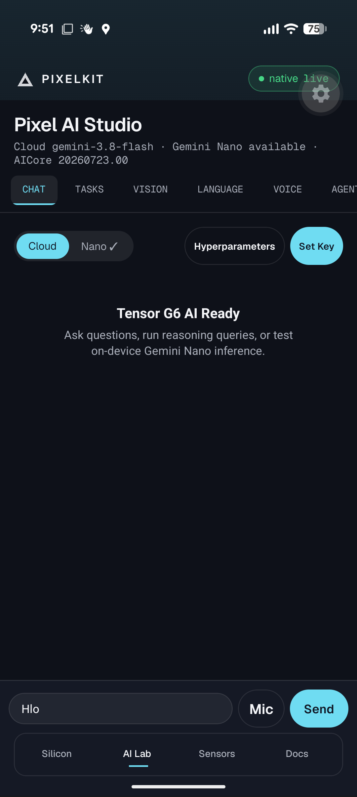

<!-- Improved compatibility of back to top link: See: https://github.com/othneildrew/Best-README-Template/pull/73 -->
<a id="readme-top"></a>

<!-- PROJECT SHIELDS -->
<!--
*** Using markdown "reference style" links for readability.
*** See the bottom of this document for reference variables.
-->
[![Contributors][contributors-shield]][contributors-url]
[![Forks][forks-shield]][forks-url]
[![Stargazers][stars-shield]][stars-url]
[![Issues][issues-shield]][issues-url]
[![MIT License][license-shield]][license-url]
[![Expo SDK][expo-shield]][expo-url]
[![React Native][rn-shield]][rn-url]
[![Android][android-shield]][android-url]
[![Gemini Cloud][gemini-shield]][gemini-url]
[![Gemini Nano][nano-shield]][mlkit-url]
[![TypeScript][ts-shield]][ts-url]
[![Version][version-shield]][changelog-url]

<!-- PROJECT LOGO -->
<br />
<div align="center">
  <a href="https://github.com/Traves-Theberge/PixelKit">
    
  </a>

  <h2 align="center">PixelKit SDK</h2>

  <p align="center">
    A hardware and on-device AI framework for the <strong>Google Pixel 11 Pro</strong> (Android 17, Google Tensor G6).
    <br />
    32 typed React hooks over real Android telemetry, two local Kotlin Expo Modules, and an app that refuses to invent a number.
    <br />
    <br />
    <a href="./docs/README.md"><strong>Explore the docs »</strong></a>
    <br />
    <br />
    <a href="#interface--gallery">View Gallery</a>
    &middot;
    <a href="https://github.com/Traves-Theberge/PixelKit/issues/new?labels=bug">Report Bug</a>
    &middot;
    <a href="https://github.com/Traves-Theberge/PixelKit/issues/new?labels=enhancement">Request Feature</a>
  </p>
</div>

<!-- TABLE OF CONTENTS -->
<details open>
  <summary>Table of Contents</summary>
  <ol>
    <li>
      <a href="#about-the-project">About The Project</a>
      <ul>
        <li><a href="#built-with">Built With</a></li>
        <li><a href="#core-architectural-principles">Core Architectural Principles</a></li>
      </ul>
    </li>
    <li><a href="#interface--gallery">Interface &amp; Gallery</a></li>
    <li><a href="#telemetry-provenance">Telemetry Provenance</a></li>
    <li>
      <a href="#api-reference--hook-matrix">API Reference &amp; Hook Matrix</a>
      <ul>
        <li><a href="#hardware--silicon-hooks-24">Hardware &amp; Silicon Hooks (24)</a></li>
        <li><a href="#ai--neural-hooks-8">AI &amp; Neural Hooks (8)</a></li>
      </ul>
    </li>
    <li><a href="#verified-device-facts">Verified Device Facts</a></li>
    <li><a href="#hilight-led-array">HiLight LED Array</a></li>
    <li><a href="#honesty-matrix--still-simulated">Honesty Matrix &amp; Still Simulated</a></li>
    <li>
      <a href="#getting-started">Getting Started</a>
      <ul>
        <li><a href="#prerequisites">Prerequisites</a></li>
        <li><a href="#installation--quick-start">Installation &amp; Quick Start</a></li>
        <li><a href="#wireless-debugging-workflow">Wireless Debugging Workflow</a></li>
      </ul>
    </li>
    <li><a href="#project-structure">Project Structure</a></li>
    <li><a href="#usage">Usage</a></li>
    <li><a href="#release-build">Release Build</a></li>
    <li><a href="#documentation">Documentation</a></li>
    <li><a href="#roadmap">Roadmap</a></li>
    <li><a href="#contributing">Contributing</a></li>
    <li><a href="#license">License</a></li>
    <li><a href="#contact">Contact</a></li>
    <li><a href="#acknowledgments">Acknowledgments</a></li>
  </ol>
</details>

---

<!-- ABOUT THE PROJECT -->
## About The Project

[](https://github.com/Traves-Theberge/PixelKit)

PixelKit maps the physical silicon and on-device machine learning stack of the **Google Pixel 11 Pro** (Android 17, Google Tensor G6) into strongly-typed React hooks. Hardware access routes through Expo modules and two local Kotlin Expo Modules (`modules/pixel-native` and `modules/pixel-nano`), eliminating fragmented native bridges.

Most hardware diagnostic apps rely on synthetic benchmarks, simulated fallbacks, or marketing assumptions. PixelKit was engineered with a strict imperative:

> **No mocks.** Every hook exposes `source: 'hardware' | 'derived' | 'simulated' | 'unavailable'`. A value that cannot be read is `null` and renders as `—`. Nothing is ever substituted with a plausible default.

This makes PixelKit usable as ground truth by autonomous coding agents (Claude, Gemini, Antigravity, Delta) and system engineers alike. Every telemetry card in the app explicitly states where its number came from.

### Built With

* [![Expo][expo-badge]][expo-url]
* [![React Native][rn-badge]][rn-url]
* [![Kotlin][kotlin-badge]][kotlin-url]
* [![Android 17][android-badge]][android-url]
* [![Google ML Kit][mlkit-badge]][mlkit-url]
* [![Google GenAI][gemini-badge]][gemini-url]
* [![TypeScript][ts-badge]][ts-url]

### Core Architectural Principles

* **Real Hardware Telemetry**: Live CPU cluster frequencies directly from sysfs (`/sys/devices/system/cpu/cpufreq`), offscreen EGL GPU identification, Choreographer frame pacing, and Android 17 ADPF thermal headroom.
* **On-Device Tensor G6 Intelligence**: Native Gemini Nano chat via ML Kit GenAI Prompt API running locally on the TPU/AICore with sub-600ms latency, zero cloud round-trips, and native token decode metrics.
* **Complete On-Device ML Kit Suite**: Local summarization, grammar proofreading, rewriting across 6 tones, 58-language offline neural translation, OCR v2, face mesh, and barcode analysis.
* **Android 17 AppFunctions Actuator Registry**: Exposes PixelKit hardware actuators (HiLight LED array, variable-level torch, LRA haptic envelopes) to the OS `app_function` service for system assistants (Gemini, Ask Pixel).
* **Single Barrel Import**: Application code imports all hooks, types, and UI primitives from a single entry point: `./src`.

<p align="right">(<a href="#readme-top">back to top</a>)</p>

---

<!-- INTERFACE GALLERY -->
## Interface & Gallery

*All captures recorded live on the physical Google Pixel 11 Pro (`grizzly`) over ADB. Every telemetry metric displays an honest provenance badge (`HW`, `DERIVED`, `SIMULATED`, `N/A`).*

| Silicon Dashboard | On-Device Gemini Nano Chat |
| :---: | :---: |
| [](./docs/assets/screenshots/01_silicon_dashboard.png) | [](./docs/assets/screenshots/02_ailab_chat.png) |
| *Tensor G6 CPU cluster frequencies, thermals, and 120Hz ARR display HUD* | *On-device Gemini Nano conversational inference (<600ms latency) via AICore* |

| Hyperparameter Studio Drawer | On-Device Vision Subsystem |
| :---: | :---: |
| [](./docs/assets/screenshots/02_ailab_chat_params.png) | [](./docs/assets/screenshots/04_ailab_vision.png) |
| *Real-time temperature, topK, candidate count, and token budget tuning* | *Live camera scene analysis, OCR v2, barcode scanning, and 468-point face mesh* |

| Offline 58-Language Translation | Android 17 AppFunctions Actuators |
| :---: | :---: |
| [](./docs/assets/screenshots/05_ailab_language.png) | [](./docs/assets/screenshots/06_ailab_agents.png) |
| *Zero-network neural machine translation and BCP-47 language identification* | *AppFunctions registration for system agents, plus HiLight & Torch actuators* |

| Hardware & Sensor Lab | Physical UWB & Rear Torch Actuators |
| :---: | :---: |
| [](./docs/assets/screenshots/07_sensors_lab.png) | [](./docs/assets/screenshots/07_sensors_radios.png) |
| *6-axis IMU, magnetometer, barometer, ambient light, and studio audio metering* | *Physical UWB chip state, Bluetooth 5.4 Channel Sounding, and 21-level rear torch* |

<div align="center">
  <h3>Interactive In-App API Documentation</h3>
  <a href="./docs/assets/screenshots/08_docs_screen.png">
    
  </a>
  <p><em>Full in-app reference with structured inputs, outputs, runnable code snippets, and agent implementation rules.</em></p>
</div>

<p align="right">(<a href="#readme-top">back to top</a>)</p>

---

<!-- TELEMETRY PROVENANCE -->
## Telemetry Provenance

PixelKit strictly avoids inventing data. The four provenance values defined in `TelemetrySource` (`src/core/observability.ts`) enforce clear guarantees:

| Source | Meaning | Concrete Example |
| :--- | :--- | :--- |
| `hardware` | Read directly from a verified device API / sysfs during this run | `useCPU` per-core MHz from cpufreq |
| `derived` | Computed mathematically from genuine hardware readings | `useCPU` app CPU share (process time ÷ wall time) |
| `simulated` | State model maintained in memory; no underlying hardware write | `useHiLight` when the LED daemon is not running |
| `unavailable` | Could not be read; value is explicitly `null` (renders as `—`) | Any native-backed hook executing on web or in Expo Go |

All provenance events are logged with a `[PixelKit]` tag, inspectable via `adb logcat -s ReactNativeJS` and in the live observability stream on the Silicon tab.

<p align="right">(<a href="#readme-top">back to top</a>)</p>

---

<!-- API REFERENCE -->
## API Reference & Hook Matrix

PixelKit exposes **32 strongly-typed React hooks** across two distinct categories:

### Hardware & Silicon Hooks (24)

| Subsystem | Hook | Underlying Android HAL / System API | Provenance |
| :--- | :--- | :--- | :--- |
| **Tensor G6 CPU** | `useCPU()` | `/proc/cpuinfo`, cpufreq sysfs, cluster utilization | `hardware` / `derived` |
| **PowerVR GPU** | `useGPU()` | EGL context renderer/vendor, Choreographer frame pacing | `hardware` |
| **Tensor TPU / AICore** | `useTPU()` | AICore / PCS package versions, NPU feature flag, CPU benchmark fallback | `hardware` / `derived` |
| **LPDDR5X Memory** | `useMemory()` | `ActivityManager.getMemoryInfo`, JVM heap, native runtime heap | `hardware` |
| **Thermals & ADPF** | `useADPF()` | `PowerManager.getThermalHeadroom`, status listener, SystemHealth headroom | `hardware` / `derived` |
| **120Hz LTPO Display** | `useDisplay()` | Display mode enumeration, continuous ARR rate listener, HDR capabilities | `hardware` |
| **HiLight LED Array** | `useHiLight()` | **[Pro]** 8-LED rear flash ring via ADB daemon (`android.hardware.lights`) | `hardware` / `simulated` |
| **Rear Torch** | `useTorch()` | `CameraManager.setTorchMode` & Android 13+ variable strength levels (1–21) | `hardware` |
| **LRA Haptics** | `useHaptics()` | `expo-haptics`, Vibrator capabilities, Android 16+ `BasicEnvelopeBuilder` | `hardware` |
| **Motion & Atmosphere** | `useSensors()` | 6-axis IMU (accelerometer, gyroscope), magnetometer, barometer, lux | `hardware` |
| **Pro Camera** | `useCamera()` | `expo-camera`, photo capture, video recording, zoom, torch, permissions | `hardware` |
| **Video Playback** | `useVideo()` | `expo-video`, frame-accurate playback, position/duration, scrubber polling | `hardware` / `unavailable` |
| **Media Gallery** | `useMediaLibrary()` | `expo-media-library`, save captures to device gallery, album management | `hardware` / `unavailable` |
| **Studio Audio** | `useAudio()` | `expo-audio`, 16kHz speech / 48kHz studio, dBFS meter, mic selection, routing | `hardware` |
| **NFC Controller** | `useNFC()` | Physical `NfcAdapter` state, antenna status, Android 15+ Observe Mode | `hardware` |
| **Bluetooth LE** | `useBLE()` | Physical BLE adapter state, Bluetooth 5.4 Channel Sounding, bonded list | `hardware` |
| **Ultra-Wideband** | `useUWB()` | **[Pro]** Physical chip state & id from `UwbManager` | `hardware` |
| **Cellular Radio** | `useCellular()` | `expo-cellular`, carrier name, generation (5G/4G/3G/2G), MCC/MNC | `hardware` / `unavailable` |
| **Unified Radios** | `useRadios()` | Consolidated NFC, BLE, UWB, Wi-Fi RTT, and satellite status | `hardware` |
| **Biometrics** | `useBiometrics()` | `BiometricPrompt` hardware presence, enrollment, biometric modalities | `hardware` |
| **Hardware Keystore** | `useSecurity()` | StrongBox-backed `SecureStore` encrypted by Android Keystore | `hardware` |
| **Multi-Band GNSS** | `useLocation()` | Fine location, altitude, bearing, horizontal/vertical accuracy | `hardware` |
| **Network Telemetry** | `useNetwork()` | Active interface type, IP address, cellular metered state, airplane mode | `hardware` |
| **Device & Power** | `useDevice()` | Battery level, charging status, power save mode, system RAM | `hardware` |
| **Capabilities** | `useCapabilities()` | Unified source of truth with PackageManager capability verification | `hardware` |

### AI & Neural Hooks (8)

#### Cloud AI (Gemini 3.8 Flash)
* **`useGemini()`**: Multi-turn conversation via `@google/genai` on `gemini-3.8-flash`. Token usage derived from API `usageMetadata`. With no API key configured, appends an explicit system-role guide rather than a simulated response.
* **`useVisionAI()` (Cloud mode)**: Multimodal scene comprehension with structured JSON output and label extraction.
* **`useSpeechAI()` (Cloud mode)**: High-fidelity audio transcription for recorded audio takes.

#### On-Device Intelligence (Tensor G6 AICore & ML Kit)
* **`useGeminiNano()`**: On-device Gemini Nano conversational inference via the **ML Kit GenAI Prompt API**. Features model download with progress reporting, token counting, system prompts, native latency profiling (<600ms), time-to-first-token, and token decode velocity.
* **`useGenAITasks()`**: Specialized ML Kit GenAI task modules:
  * **Summarization**: 1–3 bullet summaries for articles and conversations.
  * **Proofreading**: Grammar correction and spelling refinement.
  * **Rewriting**: Stylistic rewrites across 6 tones (elaborate, emojify, shorten, friendly, professional, rephrase).
  * **Image Description**: On-device image captioning.
* **`useNaturalLanguageAI()`**:
  * **Offline Translation**: 58 language packs downloaded and executed locally.
  * **Language Identification**: BCP-47 detection with confidence scores.
  * **Smart Reply**: Contextual message reply generation.
  * **Entity Extraction**: Offline parsing of dates, addresses, flight codes, phone numbers, and money.
* **`useVisionAI()` (On-device suite)**:
  * **Barcode Scanning**: 1D & 2D formats (QR, Aztec, Data Matrix, PDF417).
  * **Text Recognition (OCR v2)**: High-speed on-device text parsing.
  * **Face Detection & Mesh**: 468 3D landmark points and Euler rotation angles.
  * **Object Tracking & Segmentation**: Real-time bounding boxes and selfie segmentation masks.
* **`useSpeechAI()` (On-device mode)**: Local streaming speech-to-text powered by Android System Intelligence (ASI) with real-time interim tokens.
* **`useSpeech()`**: On-device text-to-speech engine powered by `expo-speech` and the Android system speech service with voice enumeration, rate, pitch, and playback control.

<p align="right">(<a href="#readme-top">back to top</a>)</p>

---

<!-- VERIFIED DEVICE FACTS -->
## Verified Device Facts

Empirically measured and confirmed on the physical Google Pixel 11 Pro testbed over ADB on 2026-09-06:

| Specification | Hardware Value |
| :--- | :--- |
| **Device Model / Codename** | Pixel 11 Pro (`grizzly`) |
| **Operating System** | Android 17 (API Level 37) |
| **SoC** | Google Tensor G6 |
| **CPU Architecture** | 1× Arm C1-Ultra @ 4.11 GHz + 4× Arm C1-Pro @ 3.38 GHz + 2× Arm C1-Pro @ 2.65 GHz |
| **CPU Governor** | `sched_pixel` |
| **GPU** | PowerVR C-Series CXTP-48-1536 MC1, Vulkan 1.4, OpenGL ES 3.2 (via ANGLE) |
| **RAM** | 12 GB LPDDR5X (reports 11,647 MB total addressable) |
| **AICore Version** | `0.release.prod_aicore_20260723.00_RC11` |
| **HiLight LED Hardware** | 8 addressable RGB lights, `Light.LIGHT_TYPE_APPLICATION` (10), ids 1–8, 33ms min update period |
| **Declared Features** | `uwb`, `nfc`, `bluetooth_le`, `bluetooth_le.channel_sounding`, `wifi.rtt`, `telephony.satellite`, `strongbox_keystore=400`, `hardware_keystore=500` (167 total) |
| **Not Declared** | `neural_processing_unit`, `hardware.ranging` (`hasNpuFeature` and `hasRangingFeature` are accurately `false`) |
| **Object Thermometer** | **Absent.** Infrared thermopile from Pixel 8–10 Pro was retired. Sensor list contains no non-contact temperature sensor. |

*Full adb shell captures are preserved in [`docs/research/`](./docs/research/).*

<p align="right">(<a href="#readme-top">back to top</a>)</p>

---

<!-- HILIGHT LED ARRAY -->
## HiLight LED Array

The Google Pixel 11 Pro features eight addressable RGB LEDs arranged in a halo around the rear camera flash. While exposed via Android's public `android.hardware.lights` API, manipulating application lights requires `android.permission.CONTROL_DEVICE_LIGHTS`, which is restricted to `signature|privileged` system callers.

```
Third-party app (PixelKit) ──> [BLOCKED: android.permission.CONTROL_DEVICE_LIGHTS]
ADB Shell (UID 2000)       ──> [ALLOWED: android.permission.CONTROL_DEVICE_LIGHTS]
```

PixelKit solves this with a **zero-dependency standalone Java daemon** that runs as UID 2000 over ADB and exposes a local HTTP socket on `127.0.0.1:11080`:

```bash
npm run hilight:build     # Compiles scripts/hilight-daemon -> hilight-daemon.jar
npm run hilight:daemon    # Pushes to device, starts as UID 2000, and forwards port 11080
```

| Daemon State | `useHiLight().availability` | `source` | Runtime Behavior |
| :--- | :--- | :--- | :--- |
| **Running** | `hardware` | `hardware` | Actuates physical LEDs with sub-3ms latency |
| **Not Running** | `simulated` | `simulated` | Maintains state model and mirrors illumination on screen with LRA haptic clicks |
| **Non-Pro Device** | `unsupported` | `unavailable` | Actuator controls automatically hide |

Detailed architectural analysis is documented in [`docs/research/HILIGHT_LED_ARRAY.md`](./docs/research/HILIGHT_LED_ARRAY.md).

<p align="right">(<a href="#readme-top">back to top</a>)</p>

---

<!-- HONESTY MATRIX -->
## Honesty Matrix & Still Simulated

Under the no-mocks rule, any functionality without a physical HAL binding is explicitly declared:

| Hook | Genuine Hardware Today | State-Simulated Today |
| :--- | :--- | :--- |
| `useNFC()` | Adapter power state, antenna state, Android 15+ Observe Mode | Active NDEF tag read/write payloads |
| `useBLE()` | Adapter state, Bluetooth 5.4 Channel Sounding, bonded device list | Peripheral discovery scanning and continuous RSSI updates |
| `useUWB()` | Physical chip state, chip identifier, feature flags | Active spatial ranging sessions (distance, azimuth, elevation) |
| `useHiLight()` | Physical LEDs driven when the ADB daemon is running | State model and on-screen halo when daemon is disconnected |

<p align="right">(<a href="#readme-top">back to top</a>)</p>

---

<!-- GETTING STARTED -->
## Getting Started

### Prerequisites

* **Node.js**: `20.x` or higher (tested on Node 24)
* **Android SDK**: Build tools and platform-tools on system `PATH`
* **JDK**: Version `17` (required for Kotlin compilation)
* **Space-Free Build Path** (Windows): A directory path without whitespace (e.g. `C:\dev\pixel-delta\android`)

#### Optional: Google Android CLI

Google's official `android` command-line utility provides rapid layout inspection, screenshot capture, and official documentation lookups:

```bash
# Windows
curl.exe -fsSL https://dl.google.com/android/cli/latest/windows_x86_64/install.cmd -o "%TEMP%\i.cmd" && "%TEMP%\i.cmd"

# macOS (Apple Silicon)
curl -fsSL https://dl.google.com/android/cli/latest/darwin_arm64/install.sh | bash

# Linux (x86_64)
curl -fsSL https://dl.google.com/android/cli/latest/linux_x86_64/install.sh | bash
```

### Installation & Quick Start

1. Clone the repository:
   ```bash
   git clone https://github.com/Traves-Theberge/PixelKit.git
   cd PixelKit
   ```
2. Install dependencies:
   ```bash
   npm install
   ```
3. Verify TypeScript contracts:
   ```bash
   npm run typecheck       # Must exit with 0 errors
   ```
4. Build and install the development client:
   ```bash
   npm run android         # Compiles native modules and installs dev APK on connected device
   ```
5. Start the Metro bundler:
   ```bash
   npm start
   ```

> [!NOTE]
> **Expo Go is not supported.** PixelKit links two custom Kotlin Expo Modules (`pixel-native` and `pixel-nano`). Running in Expo Go will cause all native-backed telemetry to report `source: 'unavailable'`. Always use the development build (`expo-dev-client`).

### Wireless Debugging Workflow

To develop wirelessly with the physical Pixel 11 Pro:

```bash
# Pair device (Settings -> System -> Developer options -> Wireless debugging)
adb pair <device-ip>:<pairing-port>

# Connect ADB
adb connect <device-ip>:<connect-port>

# Reverse Metro bundler port
adb reverse tcp:8081 tcp:8081

# Monitor live provenance events
adb logcat -s ReactNativeJS | grep PixelKit
```

<p align="right">(<a href="#readme-top">back to top</a>)</p>

---

<!-- PROJECT STRUCTURE -->
## Project Structure

```text
Pixel delta/ (PixelKit)
├── App.tsx                      # Root shell: typography, scrims, wordmark, 4-tab bar
├── AGENTS.md                    # Canonical rules for AI agents (CLAUDE.md & GEMINI.md in sync)
├── PIXELKIT.md                  # Comprehensive AI reference and prompt manual
├── CHANGELOG.md                 # Semantic version log (every commit bumps patch)
│
├── modules/
│   ├── pixel-native/            # Kotlin Expo Module: CPU, GPU, memory, thermals, display,
│   │                            #   torch, haptics, radios, offline STT, AppFunctions
│   └── pixel-nano/              # Kotlin Expo Module: Gemini Nano (AICore) + 18 ML Kit APIs
│
├── scripts/
│   └── hilight-daemon/          # Standalone Java daemon running as UID 2000 over ADB
│
├── src/
│   ├── index.ts                 # Master barrel export for all hooks, types, and UI primitives
│   ├── core/
│   │   ├── types.ts             # Strongly-typed hardware and AI interfaces
│   │   ├── capabilities.ts      # Device capability resolver with PackageManager checks
│   │   └── observability.ts     # TelemetrySource, structured event logging
│   │
│   ├── hardware/                # 24 Hardware hooks
│   │   ├── useCPU.ts            # /proc/cpuinfo, sysfs cluster frequencies, app share
│   │   ├── useGPU.ts            # EGL identity, Choreographer frame intervals and jank
│   │   ├── useMemory.ts         # ActivityManager memory, JVM heap, native runtime
│   │   ├── useADPF.ts           # Thermal headroom, status listeners, SystemHealth
│   │   ├── useDisplay.ts        # Dynamic refresh rate (1–120Hz), ARR, HDR, brightness
│   │   ├── useDevice.ts         # Battery level, charging status, network type
│   │   ├── useSensors.ts        # IMU, magnetometer, barometer, ambient lux
│   │   ├── useHaptics.ts        # LRA feedback, Android 16 envelopes, primitives
│   │   ├── useTorch.ts          # CameraManager variable torch (levels 1–21), SOS
│   │   ├── useCamera.ts         # Photo capture, video recording, zoom, flash
│   │   ├── useVideo.ts          # expo-video frame-accurate player, playback controls
│   │   ├── useMediaLibrary.ts   # Save captures to shared gallery, album queries
│   │   ├── useAudio.ts          # Speech/studio recording, dBFS meters, mic selection
│   │   ├── useHiLight.ts        # [Pro] 8-LED ring control via ADB daemon
│   │   ├── useUWB.ts            # [Pro] UWB chip state and feature flags
│   │   ├── useNFC.ts            # NFC adapter, antenna state, Observe Mode
│   │   ├── useBLE.ts            # BLE adapter, Channel Sounding, bonded devices
│   │   ├── useCellular.ts       # Cellular carrier, generation (5G/4G), MCC/MNC
│   │   ├── useRadios.ts         # Consolidated telemetry for all radio controllers
│   │   ├── useBiometrics.ts     # BiometricPrompt fingerprint & face authentication
│   │   ├── useSecurity.ts       # Android Keystore (StrongBox) backed SecureStore
│   │   ├── useLocation.ts       # Multi-band GNSS coordinates, accuracy, altitude
│   │   ├── useNetwork.ts        # Interface, IP address, metered state, airplane mode
│   │   └── useCapabilities.ts   # Model-verified hardware capability matrix
│   │
│   ├── ai/                      # 8 AI hooks & client factory
│   │   ├── useTPU.ts            # AICore & PCS detection, CPU benchmark fallback
│   │   ├── useGemini.ts         # Cloud multi-turn chat on gemini-3.8-flash
│   │   ├── useGeminiNano.ts     # On-device Nano chat, streaming tokens, latency profiling
│   │   ├── useGenAITasks.ts     # On-device Summarize, Proofread, Rewrite, Describe
│   │   ├── useNaturalLanguageAI.ts  # 58-language offline translation, entities, smart reply
│   │   ├── useVisionAI.ts       # ML Kit vision suite + multimodal cloud Gemini
│   │   ├── useSpeechAI.ts       # Offline ASI streaming STT + cloud Gemini audio
│   │   ├── useSpeech.ts         # Platform text-to-speech engine with system voices
│   │   └── geminiClient.ts      # Client factory with encrypted key persistence
│   │
│   ├── components/              # HapticButton, MetricCard, SensorVisualizer, Decor
│   ├── theme/                   # colors.ts (design tokens), mode.ts (state -> colour)
│   └── screens/                 # Dashboard, AILab, SensorsLab, Docs
│
└── docs/                        # Subsystem references, guides, and empirical research
```

<p align="right">(<a href="#readme-top">back to top</a>)</p>

---

<!-- USAGE EXAMPLES -->
## Usage

### 1. Hardware Telemetry & Thermal Watchdog

Import directly from `./src`:

```tsx
import React from 'react';
import { View } from 'react-native';
import { useGPU, useADPF, useHiLight, useHaptics, MetricCard } from './src';

export default function ThermalMonitor() {
  const gpu = useGPU();
  const adpf = useADPF();
  const hilight = useHiLight();
  const { warning } = useHaptics();

  // Actuate hardware when the GPU approaches thermal throttle threshold
  const handleThermalAlert = async () => {
    if (adpf.isThrottling) {
      await warning();
      hilight.triggerContactAlert('#F25C55', 3000); // Red strobe on HiLight ring
    }
  };

  return (
    <View>
      <MetricCard
        title="Frame Render Time"
        value={gpu.frameRenderTimeMs}          // Unreadable values render as "—"
        unit="ms"
        badge={`Budget ${gpu.targetBudgetMs}ms`}
        subtitle={`Thermal status: ${adpf.thermalStatus}`}
        source={gpu.source}                    // Strict provenance: 'hardware'
      />
    </View>
  );
}
```

### 2. On-Device Gemini Nano Inference

Run local conversational inference without cloud dependencies:

```tsx
import { useGeminiNano } from './src';

export function OnDeviceAssistant() {
  const nano = useGeminiNano();

  const handleInquire = async () => {
    // Check AICore availability
    if (nano.status === 'downloadable') {
      await nano.download(); // Track via nano.downloadedBytes
    }

    if (nano.isAvailable) {
      await nano.sendMessage('Analyze current device CPU cluster load and suggest throttling mitigation.');
      // Real-time streaming: nano.partial
      // Native hardware metrics: nano.lastLatencyMs, nano.lastDecodeTokensPerSec
    }
  };
}
```

### 3. On-Device ML Kit Summarization & Rewriting

```tsx
import { useGenAITasks } from './src';

export function DocumentProcessor() {
  const tasks = useGenAITasks();

  const summarizeLog = async (text: string) => {
    const summary = await tasks.summarize(text, 'article');
    const polished = await tasks.rewrite(summary, 'professional');
    return polished;
  };
}
```

<p align="right">(<a href="#readme-top">back to top</a>)</p>

---

<!-- RELEASE BUILD -->
## Release Build

Current version: **1.0.16** (`package.json`, `app.json` `expo.version`, `expo.android.versionCode` 17).

```bash
# 1. Type validation
npm run typecheck

# 2. Bundle verification
npx expo export -p android

# 3. Assemble Release APK (from space-free directory)
cd android && ./gradlew assembleRelease
# Output: android/app/build/outputs/apk/release/app-release.apk
```

> [!IMPORTANT]
> Configure production signing in `android/app/build.gradle` (`signingConfigs.release`) or build via EAS (`eas build -p android`) prior to store deployment.

<p align="right">(<a href="#readme-top">back to top</a>)</p>

---

<!-- DOCUMENTATION -->
## Documentation

* **Getting Started**
  * [Documentation Hub](./docs/README.md) — Complete sitemap and navigation
  * [Quickstart Guide](./docs/getting-started/quickstart.md) — Environment setup and first run
  * [Silicon Architecture](./docs/getting-started/architecture.md) — Native bridge and HAL design
* **API Specifications**
  * [Silicon & Compute](./docs/api/silicon-compute.md) — `useCPU`, `useGPU`, `useTPU`, `useMemory`, `useADPF`
  * [Pixel Pro Exclusives](./docs/api/pro-exclusives.md) — `useHiLight`, `useUWB`
  * [Neural & AI](./docs/api/neural-ai.md) — `useGemini`, `useGeminiNano`, `useGenAITasks`, `useVisionAI`
  * [Sensors & Actuators](./docs/api/sensors-actuators.md) — `useSensors`, `useCamera`, `useTorch`, `useHaptics`
  * [Radios & Security](./docs/api/radios-security.md) — `useBiometrics`, `useSecurity`, `useBLE`, `useNFC`
  * [System & Media](./docs/api/system-media.md) — `useAudio`, `useDisplay`, `useDevice`, `useNetwork`
  * [Complete Hardware API](./docs/HARDWARE_API.md) — All modules consolidated
* **Empirical Research & Captures**
  * [Pixel 11 Pro Hardware Research](./docs/research/PIXEL_11_PRO_HARDWARE_RESEARCH.md)
  * [Device Deep Dive](./docs/research/PIXEL_11_PRO_DEEP_DIVE.md)
  * [ADB Device Profile](./docs/research/DEVICE_PROFILE_PIXEL_11_PRO.md)
  * [HiLight Hardware Protocol](./docs/research/HILIGHT_LED_ARRAY.md)
* **Agent Guidelines**
  * [AGENTS.md](./AGENTS.md) — Rules for autonomous coding agents (identical to `CLAUDE.md` and `GEMINI.md`)
  * [AI Primer](./docs/AI_PRIMER.md) — Operational architecture and prompt contracts

<p align="right">(<a href="#readme-top">back to top</a>)</p>

---

<!-- ROADMAP -->
## Roadmap

- [x] Expo SDK 57 and React Native 0.86 modular framework architecture
- [x] Local Kotlin Expo Modules: `pixel-native` and `pixel-nano`
- [x] Real-time CPU cluster frequency and governor telemetry via sysfs
- [x] 120Hz LTPO display refresh rate listener and Choreographer frame pacing
- [x] 8-LED HiLight rear halo control daemon over ADB (UID 2000)
- [x] Gemini Nano on-device chat via ML Kit GenAI Prompt API
- [x] Full Google ML Kit On-Device suite (Summarization, Proofreading, Rewriting, 58-language Translation, Vision, Pose, Mesh)
- [x] Android 17 AppFunctions service registration (`PixelAppFunctionService`)
- [x] Offline streaming speech recognition via Android System Intelligence
- [x] Interactive in-app API documentation screen with copyable examples
- [x] Strict telemetry provenance badges (`HW`, `DERIVED`, `SIMULATED`, `N/A`) across all screens
- [ ] Native BLE peripheral advertisement and active GATT service scanning
- [ ] Multi-device UWB spatial ranging via Android `RangingManager`
- [ ] Native NDEF read/write tag controller
- [ ] Standalone release signed APK pipeline with EAS Build

See the [open issues](https://github.com/Traves-Theberge/PixelKit/issues) for a full list of proposed features and known issues.

<p align="right">(<a href="#readme-top">back to top</a>)</p>

---

<!-- CONTRIBUTING -->
## Contributing

Contributions are welcome! Anyone (human or autonomous agent) contributing to PixelKit must adhere to the rules outlined in [AGENTS.md](./AGENTS.md):

1. **Changelog on every change**: Bump patch version by 0.0.1 in `package.json` and `app.json` (`version` and `versionCode`) and record entry in `CHANGELOG.md`.
2. **Docs in sync**: Keep `README.md`, `PIXELKIT.md`, API specs, and in-app documentation in sync.
3. **No mocks**: Report genuine hardware telemetry or `null` with honest provenance.

### How to Contribute

1. Fork the Project
2. Create your Feature Branch (`git checkout -b feature/AmazingFeature`)
3. Commit your Changes (`git commit -m 'feat: Add AmazingFeature'`)
4. Verify Type Safety (`npm run typecheck`)
5. Push to the Branch (`git push origin feature/AmazingFeature`)
6. Open a Pull Request

<p align="right">(<a href="#readme-top">back to top</a>)</p>

---

<!-- LICENSE -->
## License

Distributed under the MIT License. See [`LICENSE`](./LICENSE) for more information.

<p align="right">(<a href="#readme-top">back to top</a>)</p>

---

<!-- CONTACT -->
## Contact

Traves Theberge - [Traves_theberge@gmail.com](mailto:Traves_theberge@gmail.com)

Project Link: [https://github.com/Traves-Theberge/PixelKit](https://github.com/Traves-Theberge/PixelKit)

<p align="right">(<a href="#readme-top">back to top</a>)</p>

---

<!-- ACKNOWLEDGMENTS -->
## Acknowledgments

* [Othneil Drew's Best-README-Template](https://github.com/othneildrew/Best-README-Template)
* [Google DeepMind & Gemini Team](https://ai.google.dev/)
* [Expo Team & Community](https://expo.dev/)
* [React Native Team](https://reactnative.dev/)
* [Android Open Source Project (AOSP)](https://source.android.com/)
* [Google ML Kit Team](https://developers.google.com/ml-kit)

<p align="right">(<a href="#readme-top">back to top</a>)</p>

<!-- MARKDOWN LINKS & IMAGES -->
<!-- https://www.markdownguide.org/basic-syntax/#reference-style-links -->
[contributors-shield]: https://img.shields.io/github/contributors/Traves-Theberge/PixelKit.svg?style=for-the-badge
[contributors-url]: https://github.com/Traves-Theberge/PixelKit/graphs/contributors
[forks-shield]: https://img.shields.io/github/forks/Traves-Theberge/PixelKit.svg?style=for-the-badge
[forks-url]: https://github.com/Traves-Theberge/PixelKit/network/members
[stars-shield]: https://img.shields.io/github/stars/Traves-Theberge/PixelKit.svg?style=for-the-badge
[stars-url]: https://github.com/Traves-Theberge/PixelKit/stargazers
[issues-shield]: https://img.shields.io/github/issues/Traves-Theberge/PixelKit.svg?style=for-the-badge
[issues-url]: https://github.com/Traves-Theberge/PixelKit/issues
[license-shield]: https://img.shields.io/github/license/Traves-Theberge/PixelKit.svg?style=for-the-badge
[license-url]: https://github.com/Traves-Theberge/PixelKit/blob/master/LICENSE
[expo-shield]: https://img.shields.io/badge/Expo-SDK%2057-000020?style=for-the-badge&logo=expo&logoColor=white
[expo-url]: https://docs.expo.dev/versions/v57.0.0/
[rn-shield]: https://img.shields.io/badge/React%20Native-0.86.3-20232A?style=for-the-badge&logo=react&logoColor=61DAFB
[rn-url]: https://reactnative.dev/
[android-shield]: https://img.shields.io/badge/Android-17%20(API%2037)-34A853?style=for-the-badge&logo=android&logoColor=white
[android-url]: https://developer.android.com/about/versions/17
[gemini-shield]: https://img.shields.io/badge/Cloud%20AI-gemini--3.8--flash-4285F4?style=for-the-badge&logo=google&logoColor=white
[gemini-url]: https://ai.google.dev/
[nano-shield]: https://img.shields.io/badge/On--Device%20AI-Gemini%20Nano%20%2B%20ML%20Kit-00E5FF?style=for-the-badge&logo=google&logoColor=black
[mlkit-url]: https://developers.google.com/ml-kit
[ts-shield]: https://img.shields.io/badge/TypeScript-Strict%200%20Errors-3178C6?style=for-the-badge&logo=typescript&logoColor=white
[ts-url]: https://www.typescriptlang.org/
[version-shield]: https://img.shields.io/badge/Version-1.0.16-6FDCF2?style=for-the-badge
[changelog-url]: ./CHANGELOG.md

<!-- Built with badges -->
[expo-badge]: https://img.shields.io/badge/Expo_SDK_57-000020?style=for-the-badge&logo=expo&logoColor=white
[rn-badge]: https://img.shields.io/badge/React_Native_0.86-20232A?style=for-the-badge&logo=react&logoColor=61DAFB
[kotlin-badge]: https://img.shields.io/badge/Kotlin_2.0-7F52FF?style=for-the-badge&logo=kotlin&logoColor=white
[kotlin-url]: https://kotlinlang.org/
[android-badge]: https://img.shields.io/badge/Android_17_API_37-34A853?style=for-the-badge&logo=android&logoColor=white
[mlkit-badge]: https://img.shields.io/badge/Google_ML_Kit-EA4335?style=for-the-badge&logo=google&logoColor=white
[gemini-badge]: https://img.shields.io/badge/Google_GenAI-4285F4?style=for-the-badge&logo=google&logoColor=white
[ts-badge]: https://img.shields.io/badge/TypeScript_5.x-3178C6?style=for-the-badge&logo=typescript&logoColor=white
