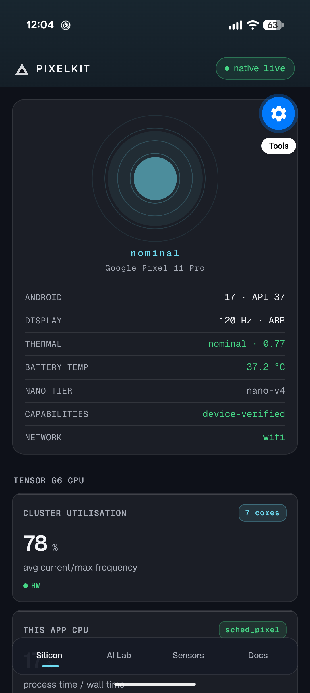

# PixelKit SDK

> **A hardware and on-device AI framework for the Google Pixel 11 Pro.**
> 28 typed React hooks over real Android telemetry, two local Kotlin Expo Modules, and an app that refuses to invent a number.

[](https://docs.expo.dev/versions/v57.0.0/)
[](https://reactnative.dev/)
[-3DDC84?style=flat-square&logo=android)](https://developer.android.com/)
[](https://ai.google.dev/)
[](https://developers.google.com/ml-kit)
[](https://www.typescriptlang.org/)
[](./CHANGELOG.md)

---

## Overview

PixelKit maps the physical silicon and on-device machine learning stack of the **Google Pixel 11 Pro** (Android 17, Google Tensor G6) into typed React hooks. Hardware access goes through Expo modules and two local Kotlin Expo Modules rather than fragmented native bridges.

The framework has one rule that shapes everything else:

> **No mocks.** Every hook exposes `source: 'hardware' | 'derived' | 'simulated' | 'unavailable'`. A value that cannot be read is `null` and renders as `—`. Nothing is ever substituted with a plausible default.

That makes PixelKit usable as ground truth by autonomous coding agents, which is the reason the provenance tag appears on every metric card in the app.

| | |
| :--- | :--- |
| **Hooks** | 21 hardware + 7 AI = **28** |
| **Native modules** | `pixel-native` (23 functions), `pixel-nano` (26 functions) |
| **App screens** | Silicon, AI Lab, Sensors, Docs |
| **Build target** | compileSdk/targetSdk 36, minSdk 26, Hermes |
| **Verified on** | Pixel 11 Pro (`grizzly`), Android 17, SDK 37, Tensor G6 |

---

## Interface

| Silicon Dashboard |
| :---: |
|  |

*Every card carries a provenance tag: `HW` read from hardware, `DERIVED` computed from hardware, `SIMULATED` state-only, `N/A` unreadable.*

---

## Telemetry provenance

The four values of `TelemetrySource` (`src/core/observability.ts`) and what each promises:

| Source | Meaning | Example |
| :--- | :--- | :--- |
| `hardware` | Read from a device API this run | `useCPU` per-core MHz from cpufreq |
| `derived` | Computed from hardware readings | `useCPU` app CPU share (process time ÷ wall time) |
| `simulated` | State model only, no hardware read | `useHiLight` when the LED daemon is not running |
| `unavailable` | Could not be read; value is `null` | Any native-backed hook on web or in Expo Go |

Events are logged with a `[PixelKit]` prefix, visible via `adb logcat -s ReactNativeJS` and in the live observability panel on the Silicon tab.

---

## Hardware & silicon hooks (21)

| Subsystem | Hook | What it actually reads |
| :--- | :--- | :--- |
| **Tensor G6 CPU** | `useCPU()` | Core topology and per-core part ids from `/proc/cpuinfo`, current/max MHz from cpufreq sysfs, kernel governor, cluster frequency utilisation (HW) and this app's CPU share (DERIVED). Android hides system-wide `/proc/stat`, so no "system load" is invented. |
| **PowerVR GPU** | `useGPU()` | `GL_RENDERER`/`GL_VENDOR`/`GL_VERSION` via an offscreen EGL context, Vulkan version from the system feature, and Choreographer frame pacing (presented FPS, average/max frame interval, jank above 1.5× expected). GPU memory is not exposed by Android → `null`. |
| **Tensor TPU / AICore** | `useTPU()` | AICore and Private Compute Services package versions, NPU feature flag. Inference metrics stay `null` here by design; real on-device latency lives in `useGeminiNano()`. `benchmarkTPU()` runs a JS matmul labelled **CPU fallback**. |
| **LPDDR5X memory** | `useMemory()` | `ActivityManager.getMemoryInfo` total/available/LMK threshold and flag, Java heap, native heap. "Purge" requests a GC and re-reads; it never claims to free system RAM. |
| **Thermals / ADPF** | `useADPF()` | `PowerManager.getThermalHeadroom` on the 10 s cadence Google recommends, live thermal-status listener, headroom thresholds, Android 16+ SystemHealth CPU/GPU headroom when reported, display target FPS vs measured FPS. |
| **Display** | `useDisplay()` | Live refresh rate re-read every 2 s (ARR changes it continuously), supported mode list, ARR support, HDR types, resolution and density, preferred-rate control, brightness, wake lock. |
| **HiLight LED array** | `useHiLight()` | **[Pixel 11 Pro family]** 8 addressable RGB LEDs around the flash. Drives the real LEDs when the local ADB daemon is running, otherwise keeps the state model and mirrors it on screen. See [HiLight](#hilight-led-array). |
| **Torch** | `useTorch()` | `CameraManager.setTorchMode`, plus `turnOnTorchWithStrengthLevel` on Android 13+ for variable brightness. State follows the system torch callback, so Quick Settings toggles are reflected. SOS strobe. |
| **Haptics** | `useHaptics()` | `expo-haptics` standard patterns plus the vibrator's real capabilities (amplitude control, resonant frequency, supported primitives) and Android 16+ envelope effects via `BasicEnvelopeBuilder`. |
| **Motion & atmosphere** | `useSensors()` | 6-axis IMU (accelerometer, gyroscope), magnetometer, barometer with hypsometric altitude, ambient light. Configurable sampling interval. |
| **Camera** | `useCamera()` | `expo-camera` lens selection, zoom, flash and permission state. Camera Looks and Super Res Zoom belong to the Pixel Camera app and are held here as UI state only. |
| **Audio** | `useAudio()` | `expo-audio` recording at 16 kHz mono through the `voice_recognition` source, with 100 ms dBFS metering. |
| **NFC** | `useNFC()` | Physical `NfcAdapter` state, antenna state, Android 15+ Observe Mode support. Tag reading is simulated until a native NDEF path lands. |
| **Bluetooth LE** | `useBLE()` | Physical adapter state, Bluetooth 5.4 Channel Sounding support, bonded devices. Peripheral scanning is simulated. |
| **UWB** | `useUWB()` | **[Pro]** Real chip state and id from `UwbManager` (`source: 'hardware'`). Ranging sessions are simulated until `RangingManager` is wired. |
| **All radios** | `useRadios()` | One unified read of NFC, Bluetooth/BLE, UWB, Wi-Fi RTT and satellite telephony from Android system services, polled every 5 s. |
| **Biometrics** | `useBiometrics()` | `BiometricPrompt` hardware presence, enrolment state, supported modalities, and an `authenticate()` prompt. |
| **Secure storage** | `useSecurity()` | `expo-secure-store` encrypted by a key held in the Android Keystore, StrongBox-backed on this device. Classical AES; no post-quantum claims. |
| **Location** | `useLocation()` | Multi-band GNSS position, altitude, accuracy, heading and speed with permission handling. |
| **Network** | `useNetwork()` | Interface type, IP address, reachability, metered state, airplane mode. |
| **Device & power** | `useDevice()` | Model and OS identity, battery level, charging state, battery-saver mode, network type, total RAM. |
| **Capabilities** | `useCapabilities()` | Single source of truth for what this Pixel physically has. Starts from the model table, then upgrades to PackageManager-verified flags and the installed AICore version when the native module is present. |

---

## AI hooks (7)

### Cloud

| Hook | Backend | Notes |
| :--- | :--- | :--- |
| `useGemini()` | `@google/genai` on **gemini-3.8-flash** | Multi-turn chat over `ai.chats` with a system instruction. Token counts come from the API's `usageMetadata`. **No simulated replies**: with no API key, `sendMessage` appends a system-role error explaining how to configure one. |
| `useVisionAI()` | Gemini multimodal **+ ML Kit on-device** | Cloud scene description with structured JSON labels, plus the on-device vision suite below. |
| `useSpeechAI()` | Offline ASI **or** Gemini audio | Dual-mode speech to text: on-device streaming recognition, or cloud transcription of a recorded clip. No simulated transcript. |

### On-device (Tensor G6 through AICore and ML Kit)

| Hook | Capability |
| :--- | :--- |
| `useGeminiNano()` | Gemini Nano chat through the **ML Kit GenAI Prompt API**: model status and download with progress, base model name, token limit, feature flags (system prompt, thinking mode, structured output, caching), streaming tokens, warm-up, on-device tokenizer counts, natively measured latency, time-to-first-token and decode rate. Sampling controls for temperature, topK, candidate count and max output tokens. |
| `useGenAITasks()` | ML Kit GenAI task modules: **summarization** (article or conversation, 1–3 bullets), **proofreading**, **rewriting** in 6 tones (elaborate, emojify, shorten, friendly, professional, rephrase), and **image description**. |
| `useNaturalLanguageAI()` | **58-language offline translation**, BCP-47 language identification with confidence, smart reply suggestions, and entity extraction (dates, addresses, money, flight and tracking numbers, phone numbers). |
| `useVisionAI()` on-device half | **Barcode scanning**, **text recognition v2 (OCR)**, **face detection** with landmarks and Euler angles, **468-point face mesh**, **image labeling**, **object detection and tracking**, **33-point pose detection**, **selfie and subject segmentation**, **digital ink recognition**. |

All on-device AI runs through `modules/pixel-nano`, which links 18 ML Kit artifacts including `genai-prompt`, `genai-summarization`, `genai-proofreading`, `genai-rewriting`, `translate`, `entity-extraction` and the vision set.

---

## Verified device facts

Measured on the target device over adb on 2026-09-06. Nothing in this table is quoted from marketing material.

| Property | Value |
| :--- | :--- |
| Model / codename | Pixel 11 Pro (`grizzly`) |
| OS | Android 17, SDK 37 |
| SoC | Tensor G6 |
| CPU topology | 1× Arm C1-Ultra @ 4.11 GHz + 4× Arm C1-Pro @ 3.38 GHz + 2× Arm C1-Pro @ 2.65 GHz, governor `sched_pixel` |
| GPU | PowerVR C-Series CXTP-48-1536 MC1, Vulkan 1.4, OpenGL ES 3.2 (via ANGLE) |
| Memory | 12 GB LPDDR5X (reports 11,647 MB total) |
| AICore | `0.release.prod_aicore_20260723.00_RC11` |
| HiLight | 8 lights, `Light.LIGHT_TYPE_APPLICATION` (10), ids 1–8, RGB + animation, 33 ms minimum update period |
| Declared features | `uwb`, `nfc` (+ `ese`, `hce`, `hcef`), `bluetooth_le`, `bluetooth_le.channel_sounding`, `wifi.rtt`, `telephony.satellite`, `strongbox_keystore=400`, `hardware_keystore=500`, `se.omapi.ese`/`uicc` (167 total) |
| **Not** declared | `neural_processing_unit`, `hardware.ranging` — so `hasNpuFeature` and the Ranging API feature flag are **false** on this unit |
| Thermometer | **Absent.** The infrared thermopile of Pixel 8–10 Pro is gone; the sensor list has no object-temperature sensor. `useTemperature` was removed in 1.0.4. |

Full captures live in [`docs/research/`](./docs/research/).

---

## HiLight LED array

The eight LEDs around the rear flash are exposed by Android 17 through the public `android.hardware.lights` API, but every lights session requires `android.permission.CONTROL_DEVICE_LIGHTS`, which is `signature|privileged`. A third-party app cannot hold it; the adb shell user (UID 2000) can.

PixelKit ships a **zero-dependency Java daemon** that runs as UID 2000 over adb and exposes a small local HTTP surface on `127.0.0.1:11080` (`/ping`, `/status`, `/set`, `/off`).

```bash
npm run hilight:build     # compile scripts/hilight-daemon → hilight-daemon.jar
npm run hilight:daemon    # push, start as UID 2000, and adb-forward port 11080
```

| Daemon | `useHiLight().availability` | `source` | Behaviour |
| :--- | :--- | :--- | :--- |
| Running | `hardware` | `hardware` | Drives the physical LEDs (~3 ms per write) |
| Not running | `simulated` | `simulated` | Keeps the colour and pattern state, mirrors it on screen with LRA haptics |
| No array | `unsupported` | `unavailable` | Card hidden |

The daemon is a development tool: it needs an adb connection and must be restarted after a reboot. Background and technical detail in [`docs/research/HILIGHT_LED_ARRAY.md`](./docs/research/HILIGHT_LED_ARRAY.md).

---

## Still simulated

Stated plainly, because the no-mocks rule requires every surface to say so:

| Hook | Real today | Simulated today |
| :--- | :--- | :--- |
| `useNFC()` | Adapter state, antenna state, Observe Mode support | Tag read/write payloads |
| `useBLE()` | Adapter state, Channel Sounding support, bonded devices | Peripheral scan results and RSSI |
| `useUWB()` | Chip state, chip id, feature flags | Ranging sessions (distance, azimuth, elevation) |
| `useHiLight()` | LEDs when the daemon runs | Colour/pattern state when it does not |

---

## Prerequisites

**Node.js 20+** (tested on 24) and the **Android SDK** with platform-tools on `PATH`.

Native builds additionally need **JDK 17** and, on Windows, a build path without spaces (see the quickstart guide).

### Optional: Google Android CLI

```bash
# Windows
curl.exe -fsSL https://dl.google.com/android/cli/latest/windows_x86_64/install.cmd -o "%TEMP%\i.cmd" && "%TEMP%\i.cmd"
# macOS (Apple Silicon)
curl -fsSL https://dl.google.com/android/cli/latest/darwin_arm64/install.sh | bash
# Linux (x86_64)
curl -fsSL https://dl.google.com/android/cli/latest/linux_x86_64/install.sh | bash
```

Useful commands: `android describe --project_dir=.`, `android layout`, `android screen capture`, `android sdk list --all`, `android skills`.

---

## Quick start

```bash
npm install
npm run typecheck            # must exit with 0 errors
npm run android              # expo run:android — builds and installs the dev client
npm start                    # Metro for subsequent runs
```

> **Expo Go will not work.** PixelKit links two local Kotlin modules (`pixel-native`, `pixel-nano`), so it needs a **development build**. In Expo Go every native-backed hook correctly reports `source: 'unavailable'` and renders `—`, which is the honest result but not a useful one.

**Wireless device workflow**

```bash
adb pair <ip>:<port>                 # once, from Wireless debugging
adb connect <ip>:<port>
adb reverse tcp:8081 tcp:8081        # so the dev client reaches Metro on localhost
adb logcat -s ReactNativeJS | grep PixelKit
```

**Web preview** (`npm run web`) renders the full UI at `http://localhost:8081` in a phone-width column. Native telemetry is `unavailable` there by design; it is useful for layout work only.

---

## Project structure

```text
Pixel delta/ (PixelKit)
├── App.tsx                      # Shell: fonts, scrims, wordmark, 4-tab navigation
├── AGENTS.md / CLAUDE.md / GEMINI.md   # Identical agent guides (keep in sync)
├── PIXELKIT.md                  # Canonical AI reference and prompt manual
├── CHANGELOG.md                 # Every change bumps the patch version
│
├── modules/
│   ├── pixel-native/            # Kotlin Expo Module: SoC, CPU, memory, thermal, display,
│   │                            #   GPU, torch, haptics, radios, offline speech, AppFunctions
│   └── pixel-nano/              # Kotlin Expo Module: Gemini Nano (ML Kit GenAI) + 18 ML Kit APIs
│
├── scripts/
│   └── hilight-daemon/          # Zero-dependency Java daemon, runs as UID 2000 over adb
│
├── src/
│   ├── index.ts                 # Single barrel export for every hook and component
│   ├── core/
│   │   ├── types.ts             # Telemetry, silicon and AI interfaces
│   │   ├── capabilities.ts      # Device capability resolver + PackageManager verification
│   │   └── observability.ts     # TelemetrySource, event log, [PixelKit] logging
│   │
│   ├── hardware/                # 21 hooks
│   │   ├── useCPU.ts            # /proc/cpuinfo + cpufreq topology, governor, load
│   │   ├── useGPU.ts            # EGL identity + Choreographer frame pacing
│   │   ├── useMemory.ts         # ActivityManager memory, Java and native heaps
│   │   ├── useADPF.ts           # Thermal headroom, status listener, SystemHealth headroom
│   │   ├── useDisplay.ts        # Refresh rate, ARR, HDR, brightness, wake lock
│   │   ├── useDevice.ts         # Battery, charging, power profile, network type
│   │   ├── useSensors.ts        # IMU, magnetometer, barometer, ambient light
│   │   ├── useHaptics.ts        # LRA patterns, Android 16 envelopes, primitives
│   │   ├── useTorch.ts          # CameraManager torch, strength levels, SOS strobe
│   │   ├── useCamera.ts         # expo-camera lens, zoom, flash, permission
│   │   ├── useAudio.ts          # expo-audio recording and dBFS metering
│   │   ├── useHiLight.ts        # [Pro] 8-LED array via the ADB daemon, else simulated
│   │   ├── useUWB.ts            # [Pro] UWB chip state; ranging simulated
│   │   ├── useNFC.ts            # NfcAdapter state, antenna, Observe Mode
│   │   ├── useBLE.ts            # Adapter, Channel Sounding, bonded devices
│   │   ├── useRadios.ts         # Unified NFC/BLE/UWB/RTT/satellite telemetry
│   │   ├── useBiometrics.ts     # BiometricPrompt fingerprint and face
│   │   ├── useSecurity.ts       # SecureStore on the Android Keystore (StrongBox)
│   │   ├── useLocation.ts       # Multi-band GNSS position, altitude, heading
│   │   ├── useNetwork.ts        # Interface, IP, reachability, airplane mode
│   │   └── useCapabilities.ts   # What this Pixel really has
│   │
│   ├── ai/                      # 7 hooks + client
│   │   ├── useTPU.ts            # AICore / PCS detection; CPU-fallback benchmark
│   │   ├── useGemini.ts         # Cloud chat on gemini-3.8-flash
│   │   ├── useGeminiNano.ts     # On-device Nano chat, streaming, measured latency
│   │   ├── useGenAITasks.ts     # Summarize, proofread, rewrite, describe image
│   │   ├── useNaturalLanguageAI.ts  # Translate (58 lang), language ID, smart reply, entities
│   │   ├── useVisionAI.ts       # ML Kit vision suite + Gemini multimodal
│   │   ├── useSpeechAI.ts       # Offline streaming STT or Gemini audio
│   │   └── geminiClient.ts      # Client factory, key persistence in SecureStore
│   │
│   ├── components/              # HapticButton, MetricCard, SensorVisualizer, Decor
│   ├── theme/                   # colors.ts (design tokens), mode.ts (state → colour)
│   └── screens/                 # Dashboard, AILab, SensorsLab, Docs
│
└── docs/                        # api/, guides/, getting-started/, ai-guidance/, research/
```

---

## Using the SDK

Everything is exported from a single barrel:

```tsx
import {
  useCPU, useGPU, useADPF, useMemory,
  useHiLight, useHaptics, useSensors, useTorch,
  useGemini, useGeminiNano, useVisionAI, useNaturalLanguageAI,
  MetricCard, HapticButton,
} from './src';

export default function ThermalWatch() {
  const gpu = useGPU();
  const adpf = useADPF();
  const hilight = useHiLight();
  const { success } = useHaptics();

  // Signal on the LED array when the device starts throttling.
  const alert = async () => {
    hilight.triggerContactAlert('#F25C55', 3000);
    await success();
  };

  return (
    <MetricCard
      title="Frame interval"
      value={gpu.frameRenderTimeMs}          // null renders as "—"
      unit="ms"
      badge={`budget ${gpu.targetBudgetMs} ms`}
      subtitle={`thermal ${adpf.thermalStatus}`}
      source={gpu.source}                     // provenance is never optional
    />
  );
}
```

On-device AI, with the status check the no-mocks rule requires:

```tsx
const nano = useGeminiNano();

if (nano.status === 'downloadable') await nano.download();   // progress in nano.downloadedBytes
if (nano.isAvailable) {
  await nano.sendMessage('Summarise the current thermal state in one sentence.');
  // nano.partial streams; nano.lastLatencyMs and nano.lastDecodeTokensPerSec are measured natively
}
```

---

## Release build

Version **1.0.13** (`package.json`, `app.json` `expo.version`, `expo.android.versionCode` 14).

```bash
npm run typecheck                       # 0 errors
npx expo export -p android              # Hermes bundle check
cd android && ./gradlew assembleRelease
# → android/app/build/outputs/apk/release/app-release.apk
```

Release builds are currently signed with the **debug keystore**. Configure `signingConfigs.release` in `android/app/build.gradle`, or build with EAS (`eas build -p android`), before distributing anything.

**Release checklist:** CHANGELOG entry, `version` and `versionCode` bumped together, typecheck clean, `expo export` clean, on-device pass recorded in `docs/research/DEVICE_TEST_REPORT_<date>.md`.

---

## Documentation

**Start here**
* [Documentation hub](./docs/README.md) — sitemap for everything below
* [Quickstart](./docs/getting-started/quickstart.md) — prerequisites, device setup, first run
* [Silicon architecture](./docs/getting-started/architecture.md) — how the layers fit together

**API reference by subsystem**
* [Silicon & compute](./docs/api/silicon-compute.md) — `useCPU`, `useGPU`, `useTPU`, `useMemory`, `useADPF`
* [Pixel Pro exclusives](./docs/api/pro-exclusives.md) — `useHiLight`, `useUWB`
* [Neural & AI](./docs/api/neural-ai.md) — `useGemini`, `useGeminiNano`, `useSpeechAI`, `useVisionAI`, `geminiClient`
* [Sensors & actuators](./docs/api/sensors-actuators.md) — `useSensors`, `useCamera`, `useTorch`, `useHaptics`
* [Radios & security](./docs/api/radios-security.md) — `useBiometrics`, `useSecurity`, `useBLE`, `useNFC`, `useLocation`
* [System & media](./docs/api/system-media.md) — `useAudio`, `useDisplay`, `useDevice`, `useNetwork`
* [HARDWARE_API.md](./docs/HARDWARE_API.md) — every module in one file

**Guides**
* [Built-in AI hub](./docs/guides/README.md) — on-device vs cloud decision tree
* [On-device AI with Gemini Nano](./docs/guides/on-device-ai-gemini-nano.md) — ML Kit GenAI Prompt API end to end
* [Function calling](./docs/guides/function-calling.md) — one tool registry for cloud, Nano and AppFunctions
* [Voice](./docs/guides/voice.md) — streaming STT, live agents, audio haptics
* [Troubleshooting](./docs/guides/troubleshooting.md) — SDK 57 nuances and thermal behaviour

**For coding agents**
* [AGENTS.md](./AGENTS.md) — the rules; identical to `CLAUDE.md` and `GEMINI.md`
* [AI_PRIMER.md](./docs/AI_PRIMER.md) — operational manual in one file
* [Agent primer](./docs/ai-guidance/agent-primer.md) and [recipes](./docs/ai-guidance/recipes.md)

**Research (device ground truth)**
* [Pixel 11 Pro hardware research](./docs/research/PIXEL_11_PRO_HARDWARE_RESEARCH.md)
* [Deep dive round 2](./docs/research/PIXEL_11_PRO_DEEP_DIVE.md)
* [Device profile](./docs/research/DEVICE_PROFILE_PIXEL_11_PRO.md) — adb-captured identity
* [HiLight LED array](./docs/research/HILIGHT_LED_ARRAY.md) — lights service, permission gate, daemon

The **Docs** tab inside the app carries the same reference with copyable snippets, filtered by subsystem, on the device itself.

---

## Contributing rules

Anyone, human or agent, working in this repository follows [AGENTS.md](./AGENTS.md). The three that matter most:

1. **Changelog on every change.** Bump the patch version in `package.json` and `app.json` together, increment `versionCode`, add a `CHANGELOG.md` entry in the same commit.
2. **Docs in sync.** A change to a hook, type, screen or dependency updates the API reference, the primers, this README, and the in-app `DocsScreen` entry.
3. **No mocks.** Render `null` as `—` and pass `source` to every `MetricCard`. If it cannot be read, say so.
